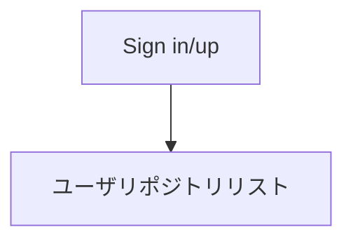
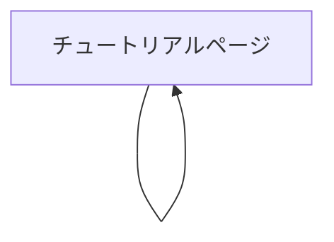

# TutHub仕様書

## 概要

huthub.topは、チュートリアル作成CLIツール「Tut」のホスティングサービスである。

tutからtuthub.topにpushすると、web.tuthub.topでチュートリアルサイトが公開されるサービスである。

## シナリオ

### ボブ

ボブは、システムエンジニアの会社員である。ボブは今年の新人研修用の資料を作成することとなった。例年では、新人にPowerPointやMarkdownで作り方を解説しながらTodoリストを作ってもらっている。しかし、ボブはこの作業が単純で面倒で時間がかかることを知っていた。そこでボブはtutというCLIをHomebrewでインストールし、gitと同じようにソースコードを変更しては解説をつけてコミットすることを繰り返して新人用の資料を作成した。その後tuthubのリポジトリにpushしてWebページとして公開した。

### マイケル

マイケルは、高専の情報工学科で「データベースとWebアプリケーション」の授業を持っている。スライドを作成してそこにコードと動作スクリーンショット、解説を載せていたが、生徒からコードのどこが変更されたのかわかりにくい、もう少し変更の粒度を小さくして解説を細かくしてほしい、との要望があった。しかしそれは非常に面倒だった。悩んでいると、友人からtutを教えてもらった。gitと同様の操作で扱えるらしい。すぐにインストールして見ると本当にgitと同じであることがわかった。コードを変更し、変更したソースファイルとスクショ画像ファイルをtut addする、ステージ上の変更ファイルをtut statusで確認する、tut commit -m 「解説」でコミットする。この一連の動作を繰り返すだけで以前のスライドよりも丁寧な解説でわかりやすいUI、また生徒が困ったら、コードをスライドと違って簡単にコピー、ペーストできるようになった。

## 本バージョンで対応しないこと

- ブランチの切り分け
- 過去のコミットの修正の伝搬

## 画面遷移

### tuthub.top画面遷移

### page.tuthub.top画面遷移

## 使用感

### tutの使用感

基本的にGitと同じ

### tuthub.topの使用感

基本的に[GitHub.com](https://github.com)と同じ

ただし、メールアドレスとパスワードでSign in/upし、Sign inするとリポジトリ一覧のリストが表示され、リストにはリポジトリのリンクがある。

### page.tuthub.topの使用感

基本的に[SwiftUI Tutorial](https://developer.apple.com/tutorials/swiftui/creating-and-combining-views)と同じ

