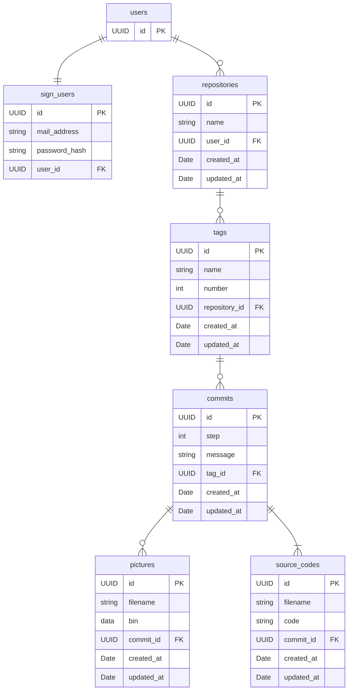

# データベース

## ER図

## 各テーブル

### users

### sign_users

- user_id: cascade delete

### repositories

- user_id: cascade delete
- user_id & name: 複合一意制約

### tags

- repository_id: cascade delete

### commits

- tag_id: cascade delete

### pictures

- commit_id: cascade delete

### source_codes

- commit_id: cascade delete
