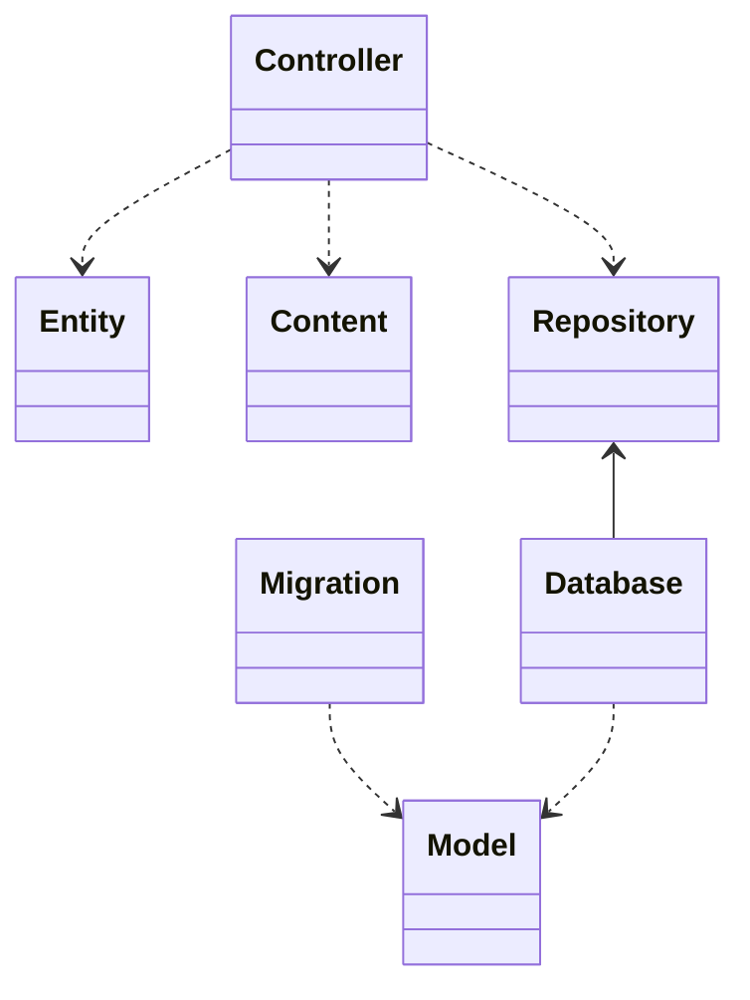

# 　設計

## ディレクトリ構成

```sh
TutHub/Sources/App
├── Auth
├── Contents
├── Controllers
├── Database
├── Entity
├── Migrations
├── Models
├── Providers
├── Renders
├── Repositories
├── Seeds
├── configure.swift
└── routes.swift
```



### Auth

- 認証
- 認可

### Contents

- VaporのContentに準拠
- クライアントやViewに渡すための構造体
- ...Contentや...Dataという命名規則

### Controllers

- VaporのRouteCollectionに準拠
- Validation処理
- DIの受け取り処理
- Requestの変換処理
- ...Collectionという命名規則

### Databases

- データベースを用いてクエリを発行処理を行う
- Repositoryに準拠する
- Modelに依存する
- 命名規則: Database...Repository

### Entities

- ドメインエンティティ
- 最も不安定度が高い

### Migrations

- DBのマイグレーション
- 基本的にModelの拡張を行い、Migration構造体を追加する
- FluentのAsyncMigrationに準拠
- 命名規則: Model名.Migration

### Models

- Fluent Model
- final class
- FluentのModelに準拠
- 命名規則: ...Model

### Providers

- DIコンテナへの登録
- 命名規則: protocol名Provider

### Repositories

- 永続化層のDI用protocol
- 命名規則: ...Repository

### Seeds

- テスト用のSeeder
- Seedableに準拠させる
- 命名規則: ...Seeder

### configure.swift

- アプリケーションの設定
- Migrationの登録
- Seederの登録
- ミドルウェアの登録

### routes.swift

- ルーティング設定
- コントローラの登録
- ミドルウェアの登録
