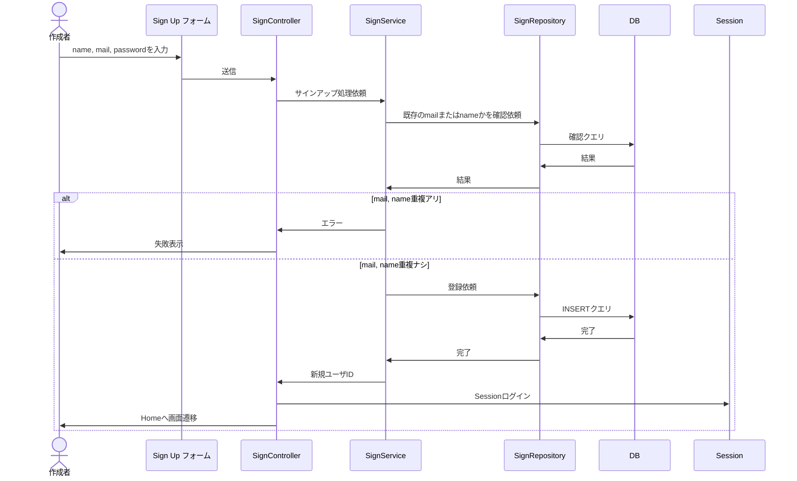
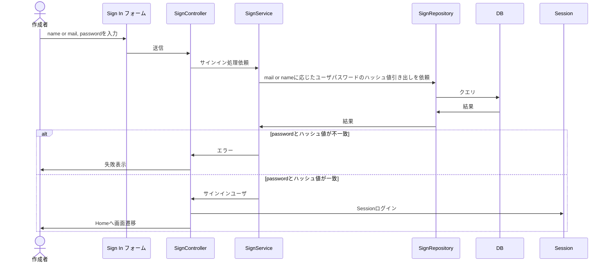
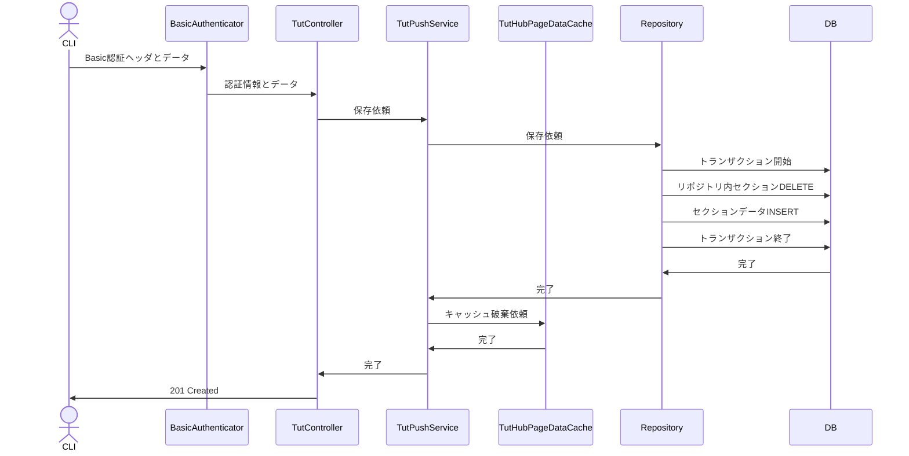
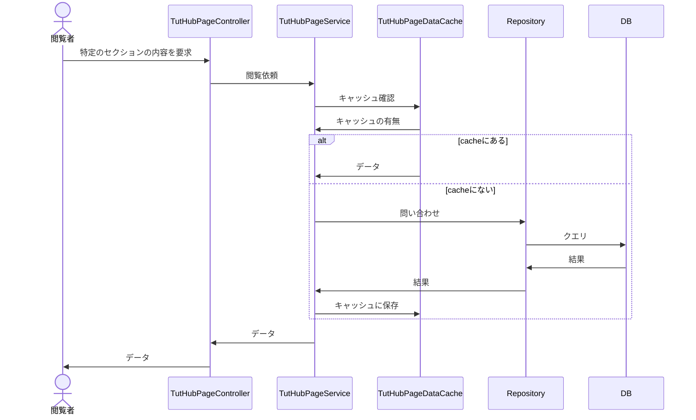

# TutHubサーバーのシーケンス設計

## TutHub Sign Up

チュートリアル制作者がTutHubにサインアップ

## TutHub Sign In

チュートリアルアップロード者がTutHubにサインイン

## Tut Push

チュートリアル制作者がコマンドラインからリポジトリをpush

## TutHub-Page

チュートリアル閲覧者がデータをリクエスト

